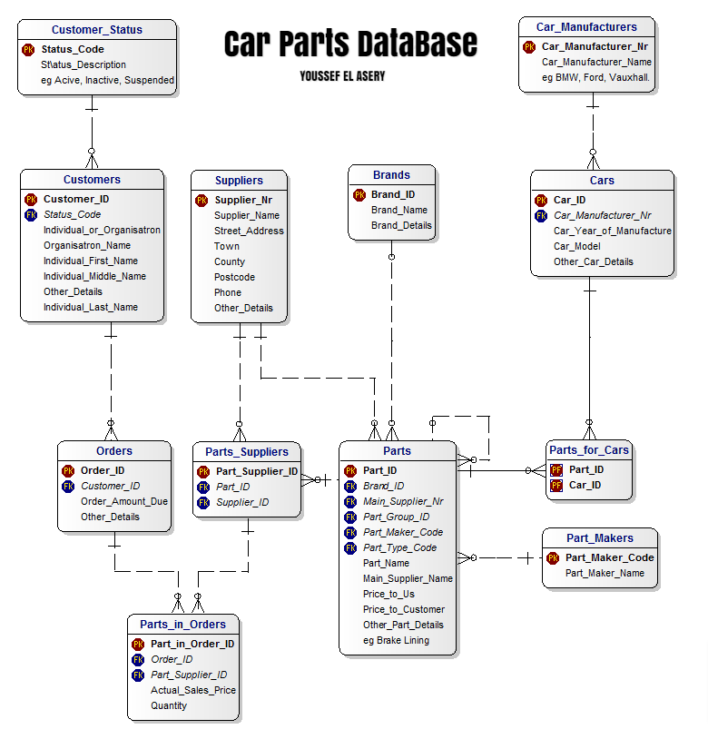
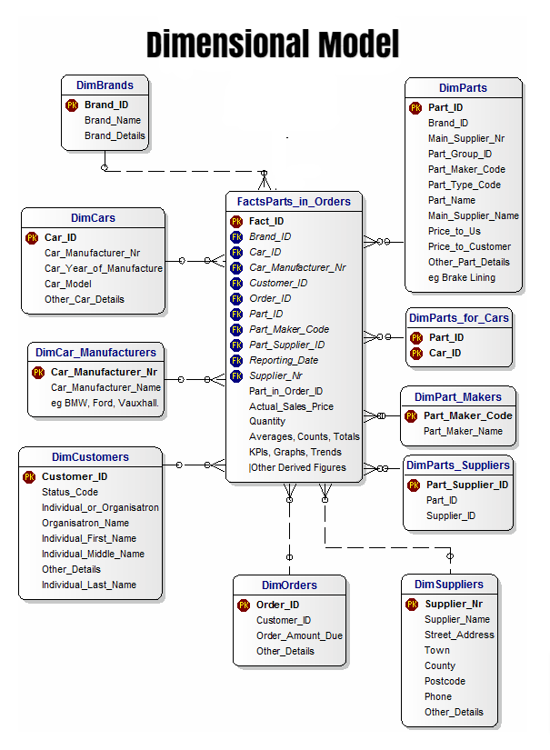

# Project: Data Pipeline

Building an ETL pipeline that extracts their data from S3, stages them in Redshift, and transforms data into a set of dimensional tables.
This allows Data Scientists to continue finding insights from the data stored in the Data warehouse.

In this project we are going to use two Amazon Web Services resources:

-   [S3](https://aws.amazon.com/en/s3/)
-   [AWS Redshift](https://aws.amazon.com/en/redshift/)

## ETL

**Data Pipeline design**: At a high-level the pipeline does the following tasks.

1.  Extract data from multiple S3 locations.
3.  Load the data into Redshift cluster.
4.  Transform the data into a star schema.

## Data Warehouse Schema Definition

This is the schema of the database

This is the schema of the data warehouse (star schema)

## Project structure

The structure is:

-   **create_tables.py** - This script will drop old tables (if exist) ad re-create new tables
-   **etl.py** - This script orchestrate ETL.
-   **sql_queries.py** - This is the ETL. All the transformatios in SQL are done here.
-   **/img** - Directory with images that are used in this markdown document

We need an extra file with the credentials an information about AWS resources named  **dhw.cfg**